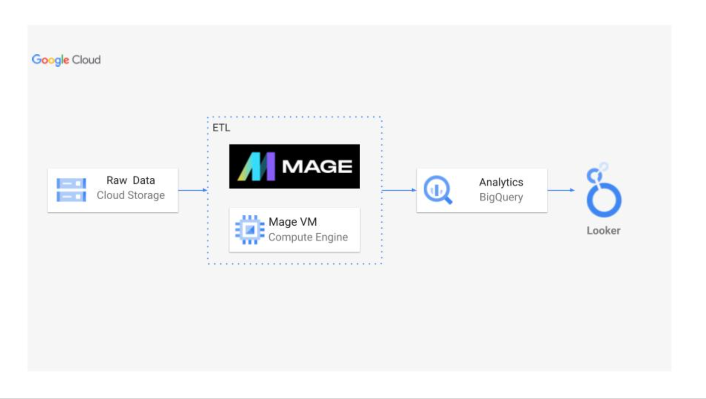
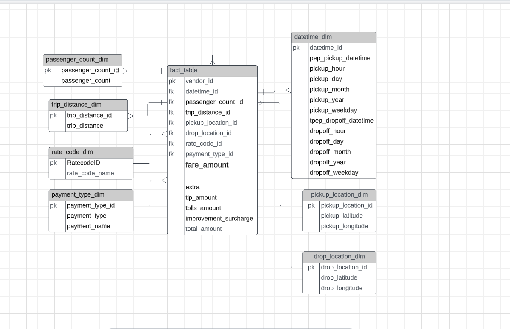
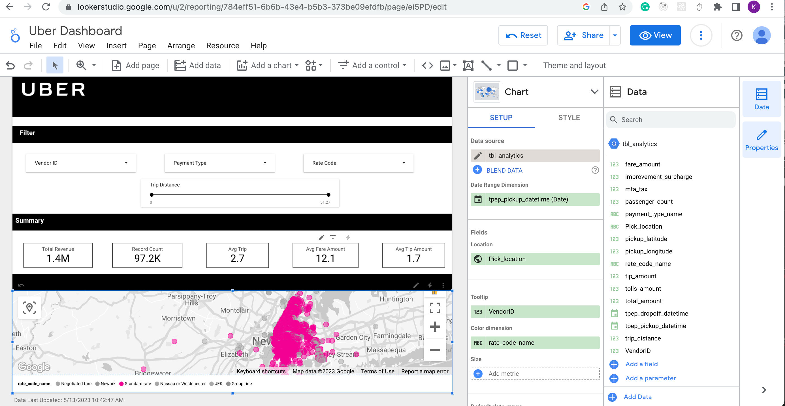

# Uber-Data-Analysis-End-to-End-Data-Engineering-Project

# Data Model for this project

# My Uber Dashboard on LookerStudio

# Tech Stacks Used for this project are:

- Jupyter Notebook
- Google Cloud Storage
- Google Cloud Bigquery
- Google Compute Engineer
- Mage Data Pipeline Tool

# Programming Language Used:

- Python
- Pandas
- SQL
